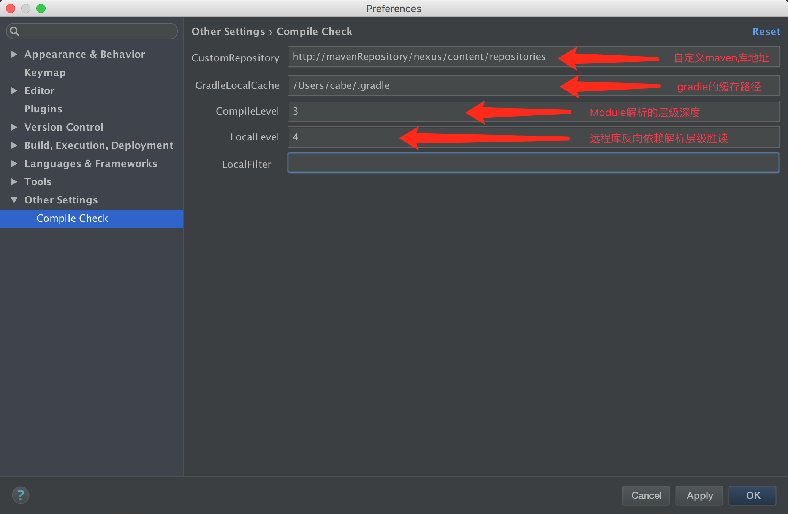

## 简介

CompileCheck是一个用于查询通过gradle构建的Module所依赖的远程库的插件，主要有三个功能： 
1、根据远程库查询当前库的依赖库 
2、查询Module所依赖的远程库关系 
3、根据扩展库查找该库在当前Project里的引用关系

## Usage

首先，安装插件“CompileCheck”并重启IDE

### Setting自定义仓库

LocalFilter是用来过滤解析反向依赖的关键字，例如：apache,springframework，表示解析的时候，过滤包含apache或者springframework的aar

#### 依赖库的反向依赖关系查询

选择需要解析的依赖库，比如“RxCache1.2”，
右键点击“Check Local Compile”，之后就会显示当前的Project里面Modul所依赖的关系了 
 

#### Module目录的compile解析

选择需要检测的Module目录，右键点击“Analyze Project Compile”，
之后就会显示改Module的build.gradle下的依赖库自身依赖的sdk信息了，
该插件只支持一级compile的解析 
 

#### 单个compile信息的查询

选择需要解析的compile库，比如“AndroidPluginDemo”，
右键点击“Compile Check”，之后就会显示该库所依赖的第三方库了 
 

## PS

该工具暂时还有一些问题：
1、一些pom的解析还不完善，比如一些dependency的库没有version字段，就没去获取最新的版本之类的
2、IDEA的gradle配置还法获取，只能依赖用户自己设置
3、解析结果的弹窗，在多个屏幕时现实不够友好，只会显示在默认的屏幕上
